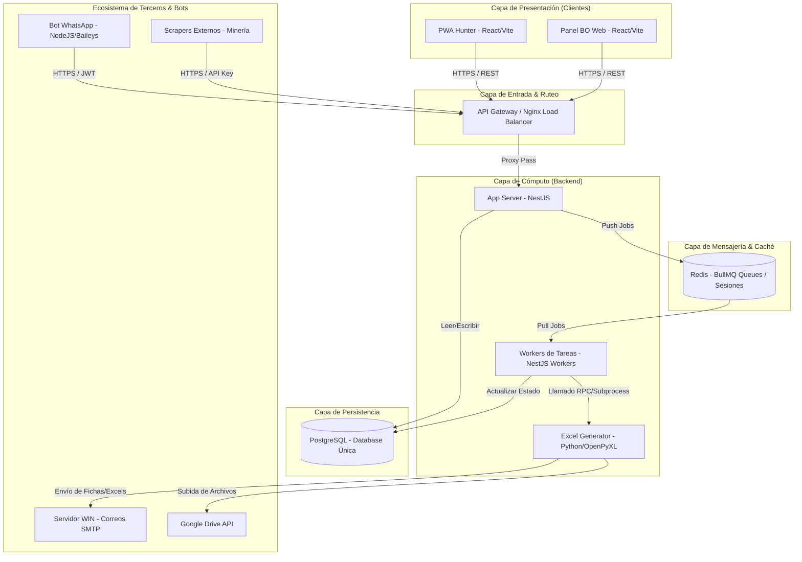
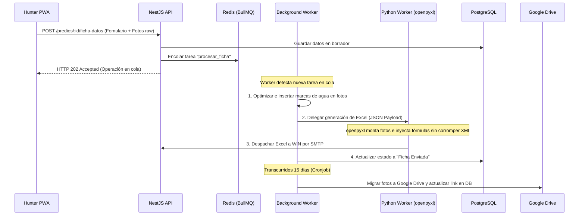
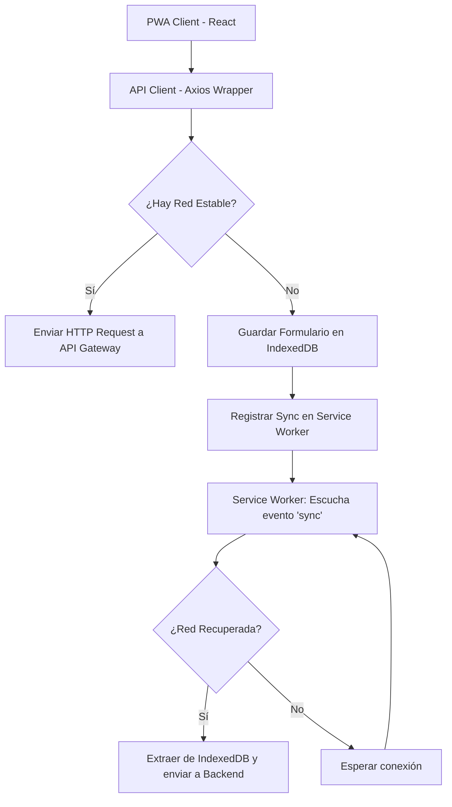
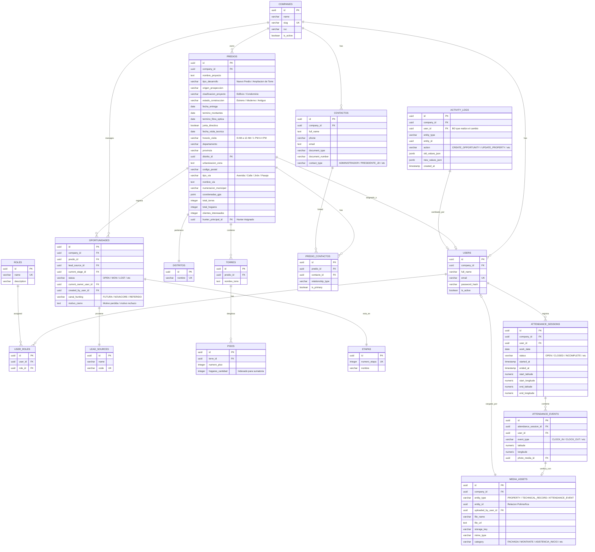

# 🏛️ Especificación de Arquitectura y Tech Stack - Etapa 2: Hunting CRM

**Rol:** Principal Cloud & Software Architect  
**Objetivo:** Definir y documentar el diseño técnico, estructural y la topología de servicios para el nuevo Hunting CRM propio, resolviendo las deudas técnicas del sistema híbrido actual y mitigando riesgos de producción.

---

## 1. Arquitectura General y Topología del Sistema

El sistema sigue un diseño desacoplado y orientado a eventos para garantizar que la experiencia de los usuarios en campo (Hunters) e inspectores operativos (BO) sea fluida y de baja latencia.

### A. Diagrama de Arquitectura Global

### B. Estrategia de Comunicación e Integración de Servicios
*   **Comunicación Síncrona (HTTP REST + JWT):** Reservada exclusivamente para operaciones interactivas que requieren respuesta inmediata (ej. autenticación, obtención de predios asignados, validación de estado en Kanban, Check-in/Check-out de asistencia).
*   **Comunicación Asíncrona (Eventos/BullMQ):** Toda operación pesada (procesamiento de imágenes, inyección de datos a Google Sheets, generación de plantillas Excel e integraciones SMTP) se despacha de inmediato a colas de mensería gestionadas en Redis por BullMQ. El API Gateway responde un status `202 Accepted` al cliente al instante, liberando la conexión de red del móvil del Hunter.

---

## 2. Arquitectura de Backend (El Motor)

### A. Stack Propuesto: Node.js con NestJS (TypeScript)
NestJS es seleccionado como el framework de backend debido a sus ventajas de nivel empresarial:
*   **Tipado Estricto con TypeScript:** Evita errores de tipo en tiempo de ejecución al interactuar con el modelo del predio y sus torres.
*   **Arquitectura Modular:** Separa limpiamente los dominios del negocio (Módulo de Asistencia, Módulo de Predios, Módulo de Integraciones).
*   **Gestión Nativa de Microservicios:** Facilita la división de la lógica en Workers independientes compartiendo la misma base de código.

### B. Manejo de Tareas Asíncronas (Task Queues con BullMQ + Redis)
El backend delega operaciones críticas a colas de prioridad baja/media/alta gestionadas por Redis:

#### Flujos de Background definidos:
1.  **Cola de Imágenes (`image-processing`):**
    *   *Acción:* Recibe los binarios de `foto_fachada` y `foto_montantes`.
    *   *Proceso:* Redimensiona, comprime (conversión a WebP para optimizar almacenamiento) e inserta metadatos de geolocalización inmutables (metadatos EXIF) del instante en que el Hunter tomó la foto.
2.  **Cola de Reportes (`report-generation`):**
    *   *Acción:* Lee la estructura de la base de datos PostgreSQL de un predio y sus torres asociadas.
    *   *Proceso (Mitigación de Corrupción):* En lugar de delegar el diseño XML del Excel a `exceljs` (inestable con capas de dibujo/fotos en plantillas pesadas), el NestJS Worker delega la compilación a un proceso secundario en **Python (usando openpyxl)**. Este script lee un archivo JSON de entrada, carga la plantilla `.xlsx`, inyecta las imágenes nativamente en las coordenadas de celda correctas sin romper la integridad del XML y realiza el despacho SMTP.
3.  **Cola de Archivamiento (`media-sync`):**
    *   *Acción:* Cronjob diario que corre en segundo plano.
    *   *Proceso:* Busca fotos locales en el storage del servidor con antigüedad mayor a 15 días, las sube a carpetas estructuradas de Google Drive mediante su API, destruye el archivo del storage local para mantener la ligereza del servidor y actualiza la URL en PostgreSQL al enlace de Drive.

---

## 3. Arquitectura de Frontend & Móvil (PWA)

### A. Stack Propuesto: React.js con Vite y TypeScript
*   **Vite:** Herramienta de compilación ultrarrápida que optimiza el empaquetado final para su descarga en dispositivos móviles.
*   **Tailwind CSS:** Para una UI ágil y responsiva basada en utility-first, asegurando consistencia visual en pantallas móviles de ejecutivos y pantallas de escritorio de BO.

### B. Estrategia Offline-First (Flujo del Cliente PWA)

La interfaz móvil del Hunter está estructurada para operar en zonas grises de cobertura mediante un sistema de sincronización diferida:

*   **Service Workers (Workbox):** Registran en caché los recursos estáticos del CRM (HTML, JS, CSS, iconos). En zonas sin cobertura móvil, la aplicación sigue cargando y funcionando.
*   **IndexedDB (localForage):** Cuando el Hunter está en sótanos o zonas sin señal, los formularios se guardan en IndexedDB y el Service Worker sincroniza en background una vez se recupera la conexión.

### C. Acceso a Hardware Nativo
*   **API de Geolocalización (Browser HTML5):** Captura las coordenadas de latitud y longitud del dispositivo móvil en el instante exacto de enviar el formulario.
*   **API de Cámara (MediaDevices API):**
    *   Configurada con el constraint `video: { facingMode: "environment" }` (cámara trasera) para capturar las fotos estructurales del predio.
    *   Para el módulo de asistencia (TimeMark), se configura con `facingMode: "user"` (cámara frontal).
    *   **Restricción de Galería:** El input del formulario de asistencia utiliza el atributo `capture="user"` y no permite la selección de archivos locales del disco (`accept="image/*"` inyectado directamente a la cámara), forzando al navegador a abrir la app de cámara nativa y previniendo la carga de imágenes precargadas de la galería.

---

## 4. Arquitectura de la Base de Datos (PostgreSQL)

### A. Estrategia de Capas (Single Source of Truth)
Eliminamos la arquitectura dual SQLite-GHL. PostgreSQL actúa como el motor relacional central donde se almacena el estado unificado del negocio en tiempo real. Se unifican la robustez multiempresa y la gestión de archivos polimórficos de la propuesta del equipo con nuestro modelo de Torres/Pisos relacionales obligatorios.

### B. Diagrama de Relación de Entidades (ERD)

El siguiente diagrama detalla la estructura normalizada de la base de datos PostgreSQL, integrando todas las tablas core del CRM propio:

---

## 5. Lógica de Automatización Dinámica (Parametrizada)

Para evitar la deuda técnica del hardcoding, todos los fallbacks, enrutamientos y credenciales se definen como variables configurables en la tabla de base de datos dedicada a parámetros de sistema (`configuracion_sistema`), la cual no es modificable por la interfaz de usuario regular sino por administradores.

### A. Parámetros de Configuración Activos
El sistema consultará esta tabla para las automatizaciones de asignación:
*   `FALLBACK_BO_FUTURA_REFERIDOS`: Almacena el ID del usuario encargado (ej. ID de `Stefano Sotomarino Goche`). Si cambia de personal, solo se actualiza este ID en el panel administrativo.
*   `FALLBACK_BO_NOVACORE`: Almacena el ID del usuario para contingencias de Novacore (ej. ID de `Alexander Watson Huamani`).
*   `GOOGLE_SHEET_DESTINO_ID`: ID del Google Sheet para Novacore.

### B. Regla de Enrutamiento
1.  **Novacore:** Si `canal_hunting` = "NOVACORE", el sistema valida al Hunter. Si el Hunter asignado es una cuenta genérica de revisión, el backend lee de la DB el parámetro `FALLBACK_BO_NOVACORE` y le reasigna la oportunidad. Posteriormente, encola la tarea para inyección en Sheets (dividiendo la coordenada GPS en `latitud` y `longitud`).
2.  **Referidos:** Si `canal_hunting` = "REFERIDO", el backend lee de la DB el parámetro `FALLBACK_BO_FUTURA_REFERIDOS` y auto-asigna la oportunidad. En la automatización de Sheets, el campo de la columna `EJECUTIVO` se escribe vacío, manteniendo la trazabilidad del referente en el sistema.

### C. Control del Back Office (Edición Pre-Automatización)
En las etapas de Validación (Etapas 6 y 14), el Back Office puede editar directamente los campos y fotos desde la interfaz de la PWA. El envío real de correos o inyección a Sheets no ocurre hasta que el BO presione manualmente el botón de "Aprobado", asegurando que la data saliente esté limpia.

---

## 6. Módulo de Asistencia (TimeMark - Informativo y Flexible)

El módulo de asistencia se simplifica para actuar como un registro de monitoreo informativo, eliminando bloqueos y penalizaciones al Hunter.

*   **Registro de Jornada sin Bloqueos:** El Hunter realiza Check-in y Check-out a través de la PWA. El sistema utiliza la cámara nativa del móvil (bloqueando galería) para capturar una selfie y registra las coordenadas GPS del Hunter en ese instante.
*   **Geofencing Informativo:** Si la distancia del Hunter a su zona asignada es superior a 200 metros, la asistencia se registra con normalidad, pero el sistema añade una etiqueta visual de **"Ubicación Irregular"** en el reporte de asistencia que lee el Back Office.
*   **Cierre de Salida Post-18:00 (Check-out Extendido):**
    *   El Hunter puede marcar su Check-out real a cualquier hora del día (por ejemplo, si se queda trabajando en un edificio complejo hasta las 19:30). El sistema registrará la hora exacta marcada por el Hunter como su hora de salida normal.
    *   **Cierre por Inactividad a Fin de Día (23:59):** Si el Hunter olvida por completo realizar el Check-out, el sistema marcará automáticamente el turno de ese día como **"Turno Incompleto"** al iniciar el día siguiente (23:59).
    *   **No restrictivo:** El Hunter podrá seguir marcando asistencia con total normalidad los días posteriores sin bloqueos de pantalla ni necesidad de ingresar justificaciones obligatorias. El estado "Turno Incompleto" queda registrado meramente para fines estadísticos e informes de auditoría del BO.

---

## 7. Riesgos y Mitigaciones Técnicas

| Riesgo Técnico Identificado | Impacto Operativo | Mitigación Arquitectónica |
| :--- | :--- | :--- |
| **Pérdida de Transiciones de Estado** (Hunters operando offline en zonas grises de señal). | Alta probabilidad de sobreescritura de estados o saltos de etapas en desorden. | **Optimistic Locking & State Machine:** Cada Oportunidad tendrá una columna de control de versión. Si un registro se actualiza offline con una versión de datos desfasada, el backend rechaza la transacción y obliga a sincronizar la última versión del servidor primero. Las transiciones de etapas son controladas por una máquina de estados estricta en NestJS. |
| **Saturación del Message Broker (Redis)** | Si el servidor se apaga o Redis se queda sin memoria física debido al flujo masivo de imágenes de las fichas de datos. | **Redis Persistence & External Temporary Storage:** Configuración de Redis con persistencia AOF (Append Only File). Adicionalmente, el NestJS no inyectará el binario de la imagen en Redis; subirá la foto raw temporalmente a un volumen local montado (`/storage/temp`) y enviará a BullMQ únicamente la ruta del archivo para procesamiento, manteniendo a Redis ligero. |
| **Abuso / Spam en el Gateway de Cloudflare** | Exposición pública del endpoint de webhooks/formularios. | **Rate Limiting & Webhook Signatures:** Implementación de Throttler en NestJS a nivel de API Gateway limitando peticiones IP. Los webhooks entrantes de integraciones de terceros deberán incluir cabeceras de firma (SHA-256) validadas contra secretos de sistema. |
