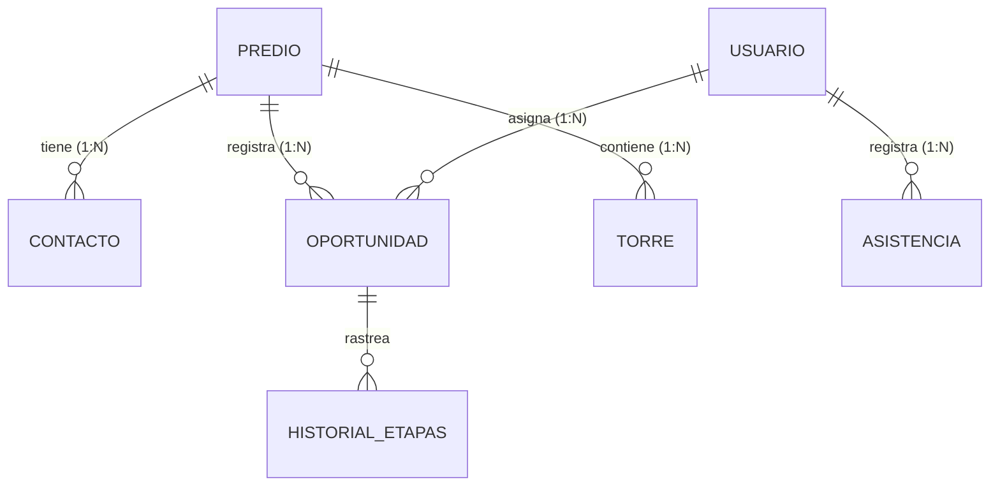

# 📘 Documentación Maestro - Etapa 1: Reglas de Negocio (Nuevo CRM In-House)

Este documento detalla la lógica de negocio pura para el nuevo CRM Propio de Hunting, incorporando las correcciones en el modelo de entidades, flujos de formularios, perfiles de usuarios y reglas de control horario no restrictivo.

---

## 1. Modelo de Entidades y Actores (Lógica de Negocio)

En nuestro CRM propio, la base de datos se estructura de manera relacional limpia, eliminando el acoplamiento genérico impuesto por GHL.



### A. Estructura y Relaciones Core
*   **Predio (Edificio / Condominio):** Tabla central. Un `Predio` solo puede tener asignado un único `Usuario` de rol Hunter a la vez, garantizando exclusividad territorial.
*   **Torre (Estructura Dinámica):** Relación **1:N (Un Predio puede tener N Torres)**. Cada torre se registra en una tabla hija independiente, lo que permite soportar desde un edificio simple hasta megaproyectos o condominios de 5, 10 o más torres de forma infinita y dinámica.
*   **Usuario:** Tabla de personal de la empresa. Un `Usuario` de rol Hunter puede tener asignados múltiples predios simultáneamente (Relación 1 Hunter a N Predios).
*   **Contacto (Administradores / Responsables):** Se asocian al `Predio`. El sistema permite registrar **múltiples contactos** (ej. administrador principal, presidente de junta, vigilante) para un solo predio con el fin de retener el historial de comunicación.
*   **Oportunidad (Hunting Process):** El proceso comercial que avanza en el pipeline. Cada oportunidad puede vincularse a **muchos contactos** de los registrados en el predio para identificar quién participó en cada fase del acuerdo.
*   **Asistencia (TimeMark):** Registra el inicio y fin de la jornada del Hunter. Está asociada **únicamente al Usuario (Hunter)** y no al Predio.

### B. Mapeo de Actores y Roles
*   **Hunter (Ejecutivo de Campo):** Personal en calle encargado de prospectar predios (Formulario de Registro), gestionar la asignación y realizar el levantamiento técnico (Ficha de Datos).
*   **Supervisor Hunter:** Rol de nivel medio encargado exclusivamente de la supervisión, acompañamiento y control del desempeño de los Hunters en el campo (no gestiona tareas administrativas del sistema).
*   **Back Office (BO):** Administrador operativo del sistema. Cuenta con permisos elevados para:
    *   Administrar y configurar rutas de trabajo.
    *   Reasignar la propiedad de los predios entre Hunters.
    *   Aprobar asistencias marcadas como fuera de rango (geofencing).
    *   Editar la información técnica y fotos de los formularios enviados por los Hunters antes de que se gatillen las automatizaciones salientes (correos a WIN, Google Sheets, excels).
*   **Hunter Referido (Rol/Tag de Negocio):** Un flujo especial de usuario. Cuando registra un predio, el sistema asocia que es un referido. La oportunidad se asigna a la cuenta parametrizada como fallback de administración y se deja el campo de hunter en blanco para reportes externos, manteniendo la trazabilidad del referente.

---

## 2. Ciclo de Vida de la Oportunidad: Las 20 Etapas del Pipeline

El pipeline se compone de **20 etapas secuenciales**, permitiendo la edición previa de datos por el BO para destrabar errores de flujo.

| # | Nombre de la Etapa | Descripción Operativa y Reglas de Negocio |
| :- | :--- | :--- |
| 1 | **Edificio Prospectado** | Punto de entrada. La oportunidad se crea automáticamente aquí. **Regla de Origen:** El predio puede nacer de dos vías independientes:<br>1. *Registro manual en campo:* El Hunter rellena el Formulario de Registro de Predio (Formulario 1) desde la PWA.<br>2. *Aprobación desde la Staging Area:* El BO aprueba y asigna manualmente un lead desde la tabla externa de Oportunidades Minadas (Scraping). |
| 2 | **Prospecto Aceptado / Trabajable** | Oportunidad calificada como viable por el Supervisor o BO para continuar la gestión. |
| 3 | **Prospecto Rechazado / No Trabajable** | El predio no califica para el negocio. **Requiere obligatoriamente seleccionar un motivo de no trabajable** (vía desplegable o comentario). No equivale a Hunting Perdido. |
| 4 | **Pendiente Envío de Formulario de Asignación** | A la espera de que el Hunter complete los datos para solicitar la asignación oficial. |
| 5 | **Formulario de Asignación/Reasignación Completado** | El Hunter ha enviado el Formulario de Asignación. |
| 6 | **Validación Back Office** | El BO audita los datos ingresados en el Formulario de Asignación antes de enviar a WIN/Sheets. |
| 7 | **Solicitud de Asignación/Reasignación Enviada a WIN** | Se ha despachado la información de asignación al partner WIN. |
| 8 | **Esperando Respuesta WIN** | Tarjeta suspendida en espera de la respuesta de factibilidad por parte de WIN. |
| 9 | **Asignación Aprobada** | WIN da luz verde al proyecto de Hunting para el predio. |
| 10 | **Asignación Rechazada** | WIN niega la aprobación o factibilidad del predio. |
| 11 | **Pendiente Reasignación** | Se requiere que el Hunter vuelva a enviar el Formulario de Asignación para intentar que WIN nos otorgue el predio (generalmente porque la competencia lo tenía asignado pero no le dio seguimiento y su exclusividad expiró). |
| 12 | **Pendiente Envío de Formulario Ficha de Datos** | El Hunter debe visitar el predio para realizar el levantamiento técnico profundo. |
| 13 | **Formulario de Ficha de Datos Completado** | Ficha técnica y archivos multimedia enviados por el Hunter. |
| 14 | **Validación Back Office 2** | Auditoría minuciosa del BO a la Ficha de Datos y fotos antes del despacho técnico. |
| 15 | **Ficha de Datos Enviada a WIN** | Envío final y automatizado de la Ficha técnica y fotos (Excel + Adjuntos) a WIN. |
| 16 | **Pendiente Inicio de Habilitación (construcción)** | El proyecto está en la cola de planificación para construcción. |
| 17 | **En Habilitación Técnica** | La obra física de instalación de infraestructura está en curso. |
| 18 | **Standby por Accesos** | La habilitación está paralizada temporalmente por problemas de permisos en el predio. |
| 19 | **Habilitación Completa** | Cierre exitoso del ciclo. Infraestructura lista para la venta. |
| 20 | **Hunting Perdido/ No Recuperable** | Oportunidad perdida en cualquier fase. **Requiere obligatoriamente seleccionar un motivo de pérdida** (desplegable o comentario). |

---

## 3. Coexistencia de los 3 Formularios Core

Los tres formularios siguen coexistiendo para estructurar la recopilación de datos, pero el disparador inicial cambia de orden:

1.  **Formulario 1: Registro de Predio (El Génesis - Creación):**
    *   Es el primer formulario llenado por el Hunter. **Crea la Oportunidad en la base de datos en la Etapa 1 (Edificio Prospectado)**.
    *   *Nota:* Este paso se omite si la oportunidad nace del origen 2 (Aprobación y Asignación manual del BO desde la tabla externa de Oportunidades Minadas), ya que la Oportunidad se genera desde el backend del sistema de pre-staging.
    *   *Campos Genéricos Básicos:*
        *   `hunter_principal` (Dropdown dinámico de hunters activos).
        *   `nombre_proyecto` (Texto de validación de duplicados).
        *   `direccion` (Texto libre).
        *   `distrito` (Dropdown de 43 distritos).
        *   `hogares_potenciales` (Número entero).
        *   `resultado_visita` (Dropdown: Visita Efectiva, Visita No Efectiva, Visita Efectiva con Atención, Visita No Efectiva sin Atención).
        *   `detalle_visita` (Texto largo / Bitácora).
2.  **Formulario 2: Asignación (Despacho / Validación):**
    *   Se completa en la Etapa 5.
    *   **Propósito:** Sirve exclusivamente como el estructurador de datos básicos para que el BO valide e inicie el despacho de asignación formal a WIN (Futura) o inyección de datos a la hoja de cálculo (Novacore).
3.  **Formulario 3: Ficha de Datos (Levantamiento Técnico):**
    *   Se completa en la Etapa 13. Requiere completar la totalidad de los atributos técnicos profundos del predio (incluyendo fotos de fachada y montantes, desglose de torres y pisos).

---

## 4. Atributos del Predio (Modelo de Datos Técnico)

El predio y su oportunidad se modelan con base en los siguientes atributos genéricos, estructurados de manera flexible para permitir modificaciones futuras:

### A. Filosofía de Datos del Predio
> [!IMPORTANT]
> **El Activo Más Valioso del CRM:** Los atributos técnicos e históricos del Predio constituyen el **corazón de todo el CRM de Hunting**. El modelado de datos prioriza la consistencia y flexibilidad de esta información por encima de cualquier otro módulo del sistema.
*   **Ingesta de Información:** Los datos del Predio son introducidos a la base de datos de manera secuencial a través de los **formularios enviados por los Hunters** en campo (Registro, Asignación y Ficha de Datos).
*   **Control y Manipulación Administrativa (BO):** Los usuarios de rol **Back Office (BO)** tienen permisos de edición jerárquicos sobre la base de datos. Pueden alterar, corregir o refinar manualmente cualquiera de los atributos técnicos del predio o sus fotos adjuntas en las etapas de Validación (6 y 14) antes de que el sistema despache las automatizaciones (WIN/Sheets), protegiendo la integridad de la base.

### B. Tabla Completa de Atributos

| Categoría | Campo Genérico | Tipo de Dato | Descripción / Regla | Opciones / Valores |
| :--- | :--- | :--- | :--- | :--- |
| **Identificación** | `nombre_proyecto` | TEXT | Nombre asignado al predio. | N/A |
| **Identificación** | `tipo_desarrollo` | SINGLE_OPTIONS | Tipo de desarrollo del proyecto. | Nuevo Predio, Ampliación de Torre |
| **Identificación** | `origen_prospeccion` | SINGLE_OPTIONS | Origen de prospección del predio. | Propio |
| **Identificación** | `clasificacion_proyecto` | SINGLE_OPTIONS | Clasificación de agrupación. | Edificio (1-2 Torres), Condominio (3+ Torres) |
| **Identificación** | `estado_construccion` | SINGLE_OPTIONS | Antigüedad o estado de entrega. | Estreno, Moderno, Antiguo |
| **Identificación** | `fecha_entrega` | DATE | Fecha estimada entrega a propietarios. | N/A |
| **Identificación** | `termino_montantes` | DATE | Fecha finalización montantes. | N/A |
| **Identificación** | `termino_fibra_optica` | DATE | Fecha completado mecha fibra. | N/A |
| **Identificación** | `junta_directiva` | RADIO | Si tiene junta directiva constituida. | Si, No |
| **Responsable** | `cargo_responsable` | TEXT | Rol del contacto (Administrador, etc.). | N/A |
| **Responsable** | `nombre_responsable` | TEXT | Nombre completo del contacto. | N/A |
| **Responsable** | `telefono_responsable` | PHONE | Número telefónico de contacto. | N/A |
| **Responsable** | `correo_responsable` | TEXT | Correo electrónico de contacto. | N/A |
| **Inspección** | `fecha_visita_tecnica` | DATE | Fecha para inspección WIN. | N/A |
| **Inspección** | `horario_visita` | RADIO | Ventana horaria para el técnico. | 9 AM a 12 AM, 1 PM A 4 PM |
| **Ubicación** | `departamento` | RADIO | Departamento del predio. | Lima |
| **Ubicación** | `provincia` | RADIO | Provincia del predio. | Lima |
| **Ubicación** | `distrito` | SINGLE_OPTIONS | Distrito de Lima Metropolitana. | 43 distritos de Lima |
| **Ubicación** | `urbanizacion_zona` | TEXT | Nombre de la urbanización o etapa. | N/A |
| **Ubicación** | `codigo_postal` | TEXT | Código postal del predio. | N/A |
| **Ubicación** | `tipo_via` | SINGLE_OPTIONS | Tipo de vía (Avenida, Calle, etc.). | Avenida, Calle, Jirón, Pasaje |
| **Ubicación** | `nombre_via` | TEXT | Nombre de la calle, avenida, etc. | N/A |
| **Ubicación** | `numeracion_municipal` | TEXT | Número de puerta. | N/A |
| **Ubicación** | `coordenadas_gps` | TEXT | Latitud y longitud. | N/A |
| **Estructura** | `total_torres` | NUMERICAL | Número total de torres. | N/A |
| **Estructura** | `total_hogares` | NUMERICAL | Suma total de departamentos. | N/A |
| **Estructura (Hija)**| `torres` | RELATION (1:N) | Tabla dinámica de torres. Cada registro contiene:<br>- `nombre_torre` (TEXT)<br>- `pisos_torre` (NUMERICAL)<br>- `hogares_por_piso` (TEXT, ej. "4,4,4,2") | Permite N torres infinitas sin límite técnico. |
| **Gestión** | `clientes_interesados` | NUMERICAL | Cantidad inicial de interesados. | N/A |
| **Gestión** | `canal_hunting` | RADIO | División comercial. | FUTURA, NOVACORE |
| **Gestión** | `gestor_externo` | SINGLE_OPTIONS | Nombre del gestor/referido externo. | Lista de gestores |
| **Gestión** | `hunter_principal` | SINGLE_OPTIONS | Hunter líder asignado. | Lista de hunters |
| **Gestión** | `foto_fachada` | FILE_UPLOAD | Imagen de la fachada. | .png, .jpeg, .jpg, .pdf |
| **Gestión** | `foto_montantes` | FILE_UPLOAD | Imagen de infraestructura interior. | .png, .jpeg, .jpg, .pdf |

---

## 5. Lógica de Automatización Dinámica (Parametrizada)

Para evitar la deuda técnica del hardcoding, todos los fallbacks, enrutamientos y credenciales se definen como variables configurables en una tabla de base de datos dedicada a parámetros de sistema (`configuracion_sistema`).

```sql
-- Ejemplo conceptual del modelo de configuración dinámico
CREATE TABLE configuracion_sistema (
    clave VARCHAR(100) PRIMARY KEY,
    valor TEXT NOT NULL,
    descripcion TEXT
);
```

### A. Parámetros de Configuración Activos
El sistema consultará esta tabla para las automatizaciones de asignación:
*   `FALLBACK_BO_FUTURA_REFERIDOS`: Almacena el ID del usuario encargado (ej. ID de `Stefano Sotomarino Goche`). Si cambia de personal, solo se actualiza este ID en el panel administrativo.
*   `FALLBACK_BO_NOVACORE`: Almacena el ID del usuario para contingencias de Novacore (ej. ID de `Alexander Watson Huamani`).
*   `GOOGLE_SHEET_DESTINO_ID`: ID del Google Sheet para Novacore.

### B. Regla de Enrutamiento
1.  **Novacore:** Si `canal_hunting` = "NOVACORE", el sistema valida al Hunter. Si el Hunter asignado es una cuenta genérica de revisión, el backend lee de la DB el parámetro `FALLBACK_BO_NOVACORE` y le reasigna la oportunidad. Posteriormente, encola la tarea para inyección en Sheets (dividiendo la coordenada GPS en `latitud` y `longitud`).
2.  **Referidos:** Si `canal_hunting` = "REFERIDO", el backend lee de la DB el parámetro `FALLBACK_BO_FUTURA_REFERIDOS` y auto-asigna la oportunidad. En la automatización de Sheets, el campo de la columna `EJECUTIVO` se escribe vacío, manteniendo la trazabilidad del referente en el sistema.

### C. Control del Back Office (Edición Pre-Automatización)
En las etapas de Validación (Etapas 6 y 14), el Back Office puede editar directamente los campos y fotos desde la interfaz de la PWA. El envío real de correos o inyección a Sheets no ocurre hasta que el BO presione manualmente el botón de "Aprobado", asegurando que la data saliente esté limpia.

---

## 6. Módulo de Asistencia (TimeMark - Informativo y Flexible)

El módulo de asistencia se simplifica para actuar como un registro de monitoreo informativo, eliminando bloqueos y penalizaciones al Hunter.

*   **Registro de Jornada sin Bloqueos:** El Hunter realiza Check-in y Check-out a través de la PWA. El sistema utiliza la cámara nativa del móvil (bloqueando galería) para capturar una selfie y registra las coordenadas GPS del Hunter en ese instante.
*   **Geofencing Informativo:** Si la distancia del Hunter a su zona asignada es superior a 200 metros, la asistencia se registra con normalidad, pero el sistema añade una etiqueta visual de **"Ubicación Irregular"** en el reporte de asistencia que lee el Back Office.
*   **Cierre de Salida Post-18:00 (Check-out Extendido):**
    *   El Hunter puede marcar su Check-out real a cualquier hora del día (por ejemplo, si se queda trabajando en un edificio complejo hasta las 19:30). El sistema registrará la hora exacta marcada por el Hunter como su hora de salida normal.
    *   **Cierre por Inactividad a Fin de Día (23:59):** Si el Hunter olvida por completo realizar el Check-out, el sistema marcará automáticamente el turno de ese día como **"Turno Incompleto"** al iniciar el día siguiente (23:59).
    *   **No restrictivo:** El Hunter podrá seguir marcando asistencia con total normalidad los días posteriores sin bloqueos de pantalla ni necesidad de ingresar justificaciones obligatorias. El estado "Turno Incompleto" queda registrado meramente para fines estadísticos e informes de auditoría del BO.
